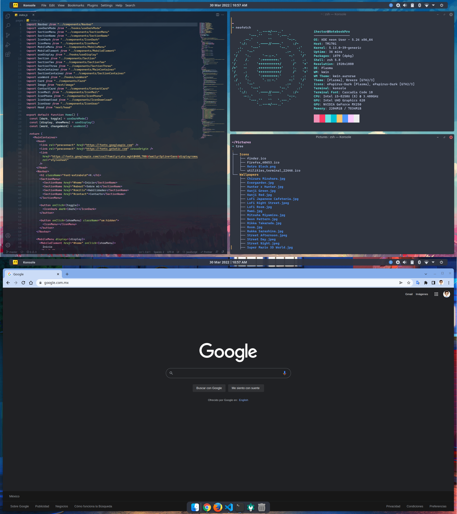

# KDE Personalization.

**There are the final result!**



This personalization was created for my personal computer. I'm currently user of KDE Neon 5.24, so some commands could be a little diferent that others S.O. like Ubuntu or Manjaro, however you can get this personalization for any distribution with KDE.

I have two monitors, so you can extends the personalization for more monitors or use in only one.

#### **System specs**


## First steps

Let's to confirm we are ready to start!

```
sudo apt update
sudo pkcon update
sudo apt install git
```

### List of applications necessaries.

| Application     | Repository                                             |
| --------------- | ------------------------------------------------------ |
| Latte Dock      | https://github.com/KDE/latte-dock                      |
| Kvantum Manager | https://github.com/tsujan/Kvantum/tree/master/Kvantum  |
| ZSH             | https://github.com/ohmyzsh/ohmyzsh/wiki/Installing-ZSH |

### List of applets/widgets necessaries.

| Applet/Widget       | Repository                                          |
| ------------------- | --------------------------------------------------- |
| Better Inline Clock | KDE Store                                           |
| Application Title   | KDE Store                                           |
| Minimal Menu        | KDE Store                                           |
| Lock / Logout       | KDE Store                                           |
| Window Buttons      | https://github.com/psifidotos/applet-window-buttons |
| Window Gaps         | KDE Store                                           |

### List of other complements.

| Complement         | Repository                                 |
| ------------------ | ------------------------------------------ |
| Cascadia Code Font | https://github.com/microsoft/cascadia-code |


**Possible problems.**  
This are problems that I experimented and solved around of two years being linux user. If you don't found the problem on the list below, you should be solve the problem searching on Google, this help you to strengthen your knowledge.

| Aplication | Problem                   | How to solve it!                            |
| ---------- | ------------------------- | ------------------------------------------- |
| Latte Dock | Don't start on startup    | Disable clipboard on the system-tray widget |
| Latte Dock | Runs very slowly on start | Use Wayland for every session.              |
| Latte Dock | as                        |
