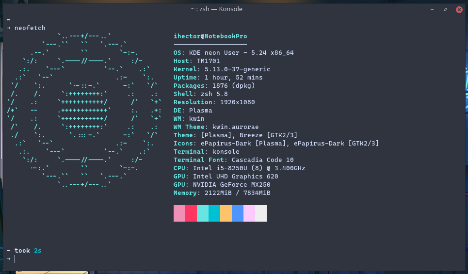
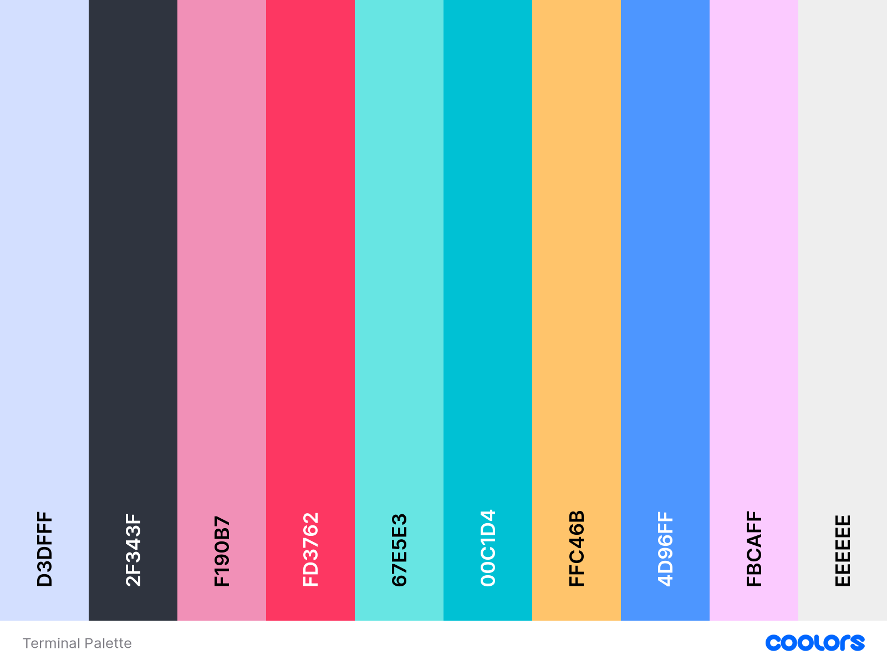

# KDE Personalization.

There are the final result!


This personalization was created for my personal computer.

#### **System specs**



## First steps

Let's to confirm we are ready to start!

```
sudo apt update
```

### List of applications necessaries for the personalization.

| Application     | Where                                                  |
| --------------- | ------------------------------------------------------ |
| Latte Dock      | https://github.com/KDE/latte-dock                      |
| Kvantum Manager | https://github.com/tsujan/Kvantum/tree/master/Kvantum  |
| ZSH             | https://github.com/ohmyzsh/ohmyzsh/wiki/Installing-ZSH |



**Possible problems.**  
This are problems that I experimented and solved around of two years being linux user. If you don't found the problem on the list below, you should be solve the problem searching on Google

| Aplication | Problem                   | How to solve it!                            |
| ---------- | ------------------------- | ------------------------------------------- |
| Latte Dock | Don't start on startup    | Disable clipboard on the system-tray widget |
| Latte Dock | Runs very slowly on start | Use Wayland for every session.              |
| Latte Dock |                           |
