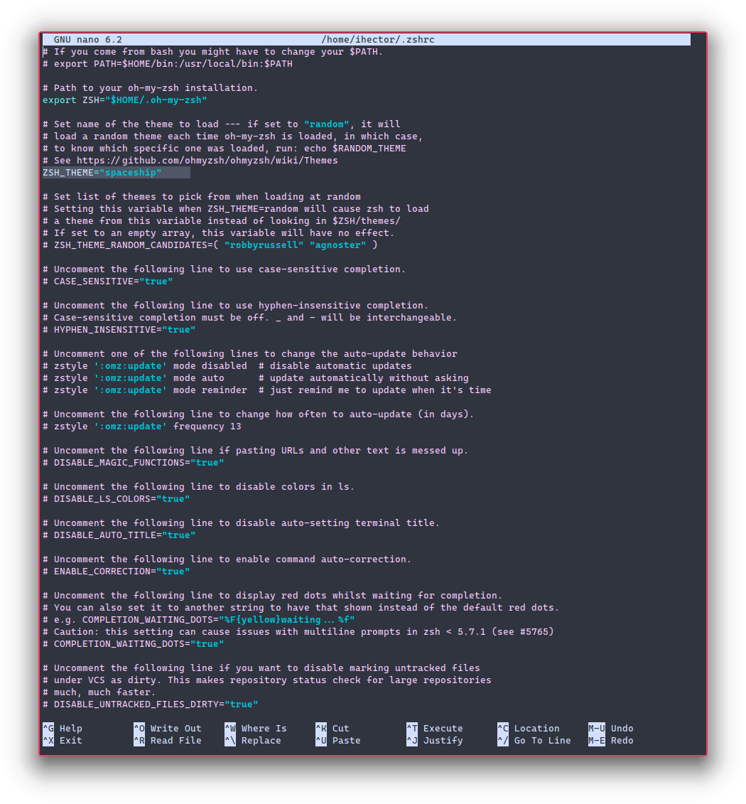

# KDE Personalization.

**Final result!**


This personalization was created for my personal computer. I'm currently user of Kubuntu 22.04 but it was originally created for KDE Neon 5.24, some commands could be a little different that others O.S. like Manjaro, however you can get this personalization for any distribution with KDE.

I have two monitors, so you can extends the personalization for more monitors or use in only one.

**System specs**


**Note:** If you had some knowledge of linux and how to install packages from GitHub skip to the [`Applications, Applets, Widgets and Stuff`](#applications-applets-widgets-and-stuff), over there you find all applications used for this personalization.

## First steps

Let's to confirm that we are ready to start! Make sure to do this, they're essencial commands for the next steps.

```
sudo apt update
sudo pkcon update

sudo apt install git
sudo apt install curl
```

## Latte Dock GitHub installation.

First, we need some dependencies, so go to install it.

**Kubuntu users only**

```
sudo add-apt-repository ppa:kubuntu-ppa/backports
sudo apt update
sudo apt dist-upgrade
```

**Kubuntu and KDE Neon**

```
sudo apt install cmake extra-cmake-modules qtdeclarative5-dev libqt5x11extras5-dev libkf5iconthemes-dev libkf5plasma-dev libkf5windowsystem-dev libkf5declarative-dev libkf5xmlgui-dev libkf5activities-dev build-essential libxcb-util-dev libkf5wayland-dev git gettext libkf5archive-dev libkf5notifications-dev libxcb-util0-dev libsm-dev libkf5crash-dev libkf5newstuff-dev libxcb-shape0-dev libxcb-randr0-dev libx11-dev libx11-xcb-dev kirigami2-dev
```

**Cloning and installing latte-dock**

```
cd Downloads
git clone https://github.com/KDE/latte-dock

cd latte-dock
sudo sh install.sh
```

**Execute latte-dock**

## Kvantum Manager installation.

Install the follow dependencies.

```
sudo add-apt-repository ppa:papirus/papirus
sudo apt update
sudo apt install qt5-style-kvantum qt5-style-kvantum-themes
```

**Execute Kvantum Manager**

1. Click on "Change/Delete Theme" and select "KvArcDark".
2. Click on "Configure Active Theme" and mark "Transparent Dolphin View".
3. Press "Quit"

### Change the appearance.

1. Settings > Appearance > Global Theme > Get New Global Themes.
   Search, download and install "Arc KDE".
2. Settings > Appearance > Application Style.
   Select "kvantum-dark".
3. Settings > Appearance > Plasma Style > Get New Plasma Style.
   Search "Arc KDE" uninstall it, press install and select "Arc Color" (this version allows follows the color scheme).
4. Settings > Appearance > Colors.
   Select "Arc Dark" and your preffered color.
5. Settings > Appearance > Window Decorations > Get New Window Decorations.
   Search, download and install "Active Accent Frame".  
   `You can change the properties of the outline on .local/share/aurorae/themes/ActiveAccentFrame/ActiveAccentFramerc`
6. Settings > Appearance > Icons > Get New Icons.
   Search, download and install "Papirus".

**The next step only will works fine on 1920x1080 screens, if you have other resolution I recommend skip this step and make your own configuration**

7. Settings > Window Management > Window Rules.  
   Select "Import" option and apply this [.kwinrule](./KwinRules/ihector.kwinrule)

### Install Cascadia Code Font.

Go to the Microsoft Cascadia Code repository and download the [.zip](https://github.com/microsoft/cascadia-code/releases) file, descompress and install all fonts.

## ZSH and Oh My Zsh installation.

**ZSH installation:**

1. On terminal run this

```
sudo apt install zsh
```

2. After this verify installation running

```
zsh --version
```

3. If the installation are successfully you can get your version. Now let's make it your default shell:

```
chsh -s $(which zsh)
```

4. Log out and log back in again to use your new default shell.

**Oh My Zsh installation:**

```
sh -c "$(curl -fsSL https://raw.github.com/ohmyzsh/ohmyzsh/master/tools/install.sh)"
```

**Theme installation:**  
After this you can personalize your terminal with [themes](https://github.com/ohmyzsh/ohmyzsh/wiki/Themes) made by the zsh community, you can install any theme following the instructions of each.

My favorite theme is [Spaceship](https://github.com/spaceship-prompt/spaceship-prompt) so we will use this for now.

First clone this repository:

```
git clone https://github.com/spaceship-prompt/spaceship-prompt.git "$ZSH_CUSTOM/themes/spaceship-prompt" --depth=1
```

Make symlink spaceship.zsh-theme to your oh-my-zsh custom themes directory:

```
ln -s "$ZSH_CUSTOM/themes/spaceship-prompt/spaceship.zsh-theme" "$ZSH_CUSTOM/themes/spaceship.zsh-theme"
```

**Set ZSH_THEME="spaceship" in your .zshrc**
All configurations about zsh and oh-my-zsh are in .zshrc file, it's simple change it but you should be careful

```
sudo nano ~/.zshrc
```

Your .zshrc file should look like this, you can remove all comments in this file but I recommend leaving it.



### Konsole profile and colorscheme.

You can download the [scheme](./KonsoleFiles/ihector.colorscheme) and [profile](./KonsoleFiles/ihector.profile) files, and put it on `.local/share/konsole` or you can configure the terminal scheme manually with this palette.


## Applications, Applets, Widgets and Stuff.

### Applications.

| Application     | Repository / Website                                   |
| --------------- | ------------------------------------------------------ |
| Latte Dock      | https://github.com/KDE/latte-dock                      |
| Kvantum Manager | https://github.com/tsujan/Kvantum/tree/master/Kvantum  |
| ZSH             | https://github.com/ohmyzsh/ohmyzsh/wiki/Installing-ZSH |
| Oh My Zsh       | https://ohmyz.sh/                                      |

### Applets/Widgets.

| Applet/Widget       | Repository                                          |
| ------------------- | --------------------------------------------------- |
| Better Inline Clock | KDE Store                                           |
| Application Title   | KDE Store                                           |
| Minimal Menu        | KDE Store                                           |
| Lock / Logout       | KDE Store                                           |
| Window Buttons      | https://github.com/psifidotos/applet-window-buttons |
| Window Gaps         | KDE Store                                           |
| Lightly Shaders     | https://github.com/a-parhom/LightlyShaders          |

### Other complements.

| Complement         | Repository                                 |
| ------------------ | ------------------------------------------ |
| Cascadia Code Font | https://github.com/microsoft/cascadia-code |

## **Possible problems.**

This are problems that I experimented and solved around of two years being linux user. If you don't found the problem on the list below, you should be solve the problem searching on Google, this help you to strengthen your knowledge.

| Application | Problem                                          | How to solve it!                             |
| ----------- | ------------------------------------------------ | -------------------------------------------- |
| Latte Dock  | Don't start on startup                           | Disable clipboard on the system-tray widget  |
| Latte Dock  | Runs very slowly on start                        | Use Wayland for every session or wait for it |
| Latte Dock  | Panel and Dock flickering on startup (Using X11) | Disable animations                           |
